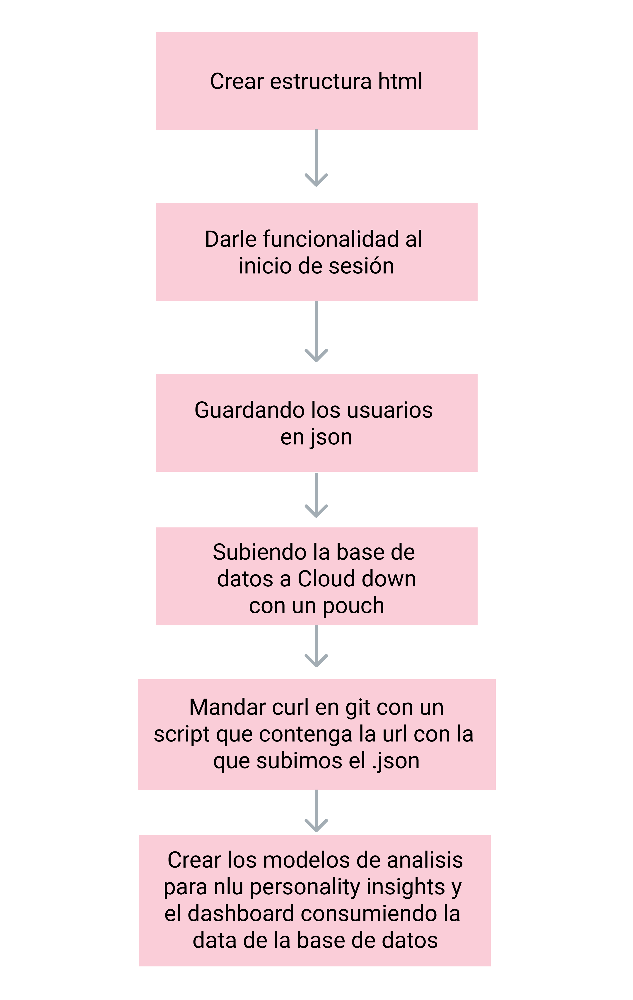

https://www.canva.com/design/DADhgO-msYE/SfD2wKrBvvniq-u1PFbvpQ/edit?category=tACFasDnyEQ

El diagrama de flujode la arquitectura de nuestra web app se desarrolla de la siguiente manera:

Como primer alcance implementaremos un nivel básico de madurez, generando un proceso para resolver incidentes, que sera ciclico e iterativo y puede ser repetido para mas de un caso similar.

Seguiriamos el proceso de iteracion constante y deteccion de vulnerabilidades y riesgos, planeando las estrategias para mitigar, delegar y asumirlos, hasta llegar un nivel en el que podamos, segura debemos asegurarnos de salvaguadar la confidencialidad, la integridad y la disponibilidad de los datos del usuario. Desde que recibimos la peticion de login se le pide autentificación, si es el usuario se le otorga la autorizacion y se hace un seguimiento durante su estancia y se crea un registro de sus acciones para posteriormente  realizar una auditoria de cada usuario y sus rutas y acciones dentro de la web app.  

Recabaremos mucha información personaly empresarial sensible por lo que los archivos donde se importan sus datos y credenciales atravesaran un proceso de cifrado de extremo a extremo y se alojaran en una base de datos protegida por firewalls y mecanismos de seguridad anti malware. 

